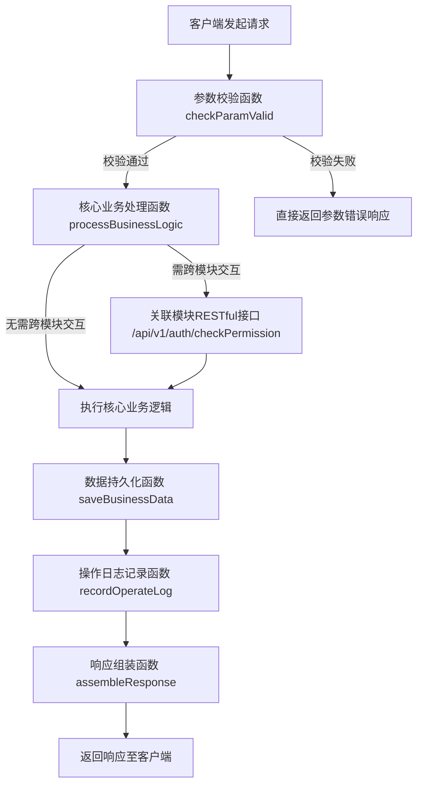

# API 文档通用模板

## 基本信息

本模块用于记录API文档的基础配置与通用信息，明确文档版本、适用环境、传输协议等核心要素，为接口使用者、开发者提供统一的文档基础参考，保障接口调用与文档查阅的一致性。

## RESTful API接口

### 接口标识：接口业务名称（如：用户信息查询）

#### 基础信息

| 项           | 详情                                 |
| :----------- | :----------------------------------- |
| 接口路径     | `/api/v1/xxx/xxx`                    |
| 请求方法     | GET/POST/PUT/PATCH/DELETE            |
| 权限要求     | 无需鉴权 / 登录token / 管理员权限    |
| Content-Type | `application/json`                   |
| 接口描述     | 简要说明接口用途、业务场景、适用范围 |

#### 入参说明

**路径参数（Path Variable）**

| 参数名 | 类型 | 是否必填 | 示例 | 说明       |
| :----- | :--- | :------- | :--- | :--------- |
| id     | Long | 是       | 1001 | 业务唯一ID |

**查询参数（Query Param）**

| 参数名   | 类型    | 是否必填 | 示例 | 说明             |
| :------- | :------ | :------- | :--- | :--------------- |
| pageNum  | Integer | 否       | 1    | 页码，默认1      |
| pageSize | Integer | 否       | 10   | 每页条数，最大50 |

**请求体参数（Request Body）**

| 参数名   | 类型    | 是否必填 | 示例        | 说明              |
| :------- | :------ | :------- | :---------- | :---------------- |
| username | String  | 是       | zhangsan    | 用户名，长度2-20  |
| phone    | String  | 是       | 13800138000 | 手机号，格式校验  |
| status   | Integer | 否       | 1           | 状态：0禁用 1启用 |
| ext      | Object  | 否       | -           | 扩展字段          |

#### 出参说明

**统一响应结构**

```JSON
{
  "code": 0,
  "msg": "success",
  "data": {},
  "requestId": "uuid-xxx"
}
```

| 字段名    | 类型         | 说明                       |
| :-------- | :----------- | :------------------------- |
| code      | Integer      | 业务码：0成功，非0失败     |
| msg       | String       | 提示信息                   |
| data      | Object/Array | 业务数据                   |
| requestId | String       | 请求唯一标识，用于排查问题 |

**业务数据结构（data）**

| 参数名     | 类型   | 示例                | 说明     |
| :--------- | :----- | :------------------ | :------- |
| userId     | Long   | 1001                | 用户ID   |
| username   | String | zhangsan            | 用户名   |
| createTime | String | 2026-01-01 12:00:00 | 创建时间 |

#### 请求示例

```HTTP
POST /api/v1/user/create HTTP/1.1
Host: api.example.com
Authorization: Bearer {token}
Content-Type: application/json

{
  "username": "zhangsan",
  "phone": "13800138000",
  "status": 1
}
```

#### 响应示例

**成功响应**

```JSON
{
  "code": 0,
  "msg": "创建成功",
  "data": {
    "userId": 1001,
    "username": "zhangsan",
    "createTime": "2026-01-01 12:00:00"
  },
  "requestId": "a1b2c3d4-e5f6-7890-abcd-1234567890ab"
}
```

**失败响应**

```JSON
{
  "code": 1001,
  "msg": "手机号格式错误",
  "data": null,
  "requestId": "a1b2c3d4-e5f6-7890-abcd-1234567890ab"
}
```

**错误码说明**

| 错误码 | 含义             |
| :----- | :--------------- |
| 0      | 成功             |
| 1001   | 参数校验失败     |
| 1002   | 资源不存在       |
| 401    | 未登录/Token过期 |
| 403    | 无权限访问       |
| 500    | 服务器异常       |

#### 业务流程

该RESTful接口内部调用链（以示例业务场景为例）如下，明确接口与内部函数、其他模块接口的关联关系，便于开发者理解接口执行逻辑：

1. 接口接收客户端请求后，首先调用参数校验函数（checkParamValid()），校验入参格式、必填项及合法性；
2. 参数校验通过后，调用核心业务函数（processBusinessLogic()），该函数根据业务需求，调用其他模块的接口或内部方法；
3. 若涉及跨模块交互，会调用关联模块的RESTful接口（如用户权限校验接口：/api/v1/auth/checkPermission），获取权限校验结果；
4. 核心业务逻辑执行完成后，调用数据持久化函数（saveBusinessData()），将业务数据写入数据库；
5. 数据持久化成功后，调用日志记录函数（recordOperateLog()），记录接口调用详情、操作人及执行结果；
6. 最后，调用响应组装函数（assembleResponse()），组装统一响应结构，将执行结果返回给客户端。




注：流程图清晰展示接口调用全链路，包含分支逻辑（参数校验成功/失败），与上方业务流程文字描述一一对应，便于快速理解接口执行逻辑。

#### 注意事项

1. 所有时间格式统一为 `yyyy-MM-dd HH:mm:ss`。
2. Token 放在 Header `Authorization` 中，前缀为 `Bearer`。
3. 分页接口最大页容量不超过50，超出按50处理。
4. 敏感接口需记录操作日志。
5. 高并发接口建议增加接口限流策略。

## 函数接口（SDK/内部方法）

### 函数标识：函数业务名称（如：用户创建函数）

#### 基础信息

| 项        | 详情                                                 |
| :-------- | :--------------------------------------------------- |
| 函数名    | createUser                                           |
| 所属包/类 | com.example.service.UserService                      |
| 语言      | Java/Go/Python/TypeScript                            |
| 功能描述  | 用于创建用户，包含参数校验、数据入库、事件发送等逻辑 |

#### 入参说明

| 参数名   | 类型    | 是否必填 | 默认值 | 说明               |
| :------- | :------ | :------- | :----- | :----------------- |
| username | String  | 是       | -      | 用户名，2-20位字符 |
| phone    | String  | 是       | -      | 合法手机号         |
| status   | Integer | 否       | 1      | 账户状态           |
| operator | String  | 是       | -      | 操作人账号         |

#### 返回值说明

| 返回类型 | 字段     | 说明           |
| :------- | :------- | :------------- |
| UserVO   | userId   | 创建后的用户ID |
|          | username | 用户名         |
|          | success  | 是否创建成功   |

**异常/错误说明**

| 异常类型   | 触发场景       |
| :--------- | :------------- |
| ParamError | 参数不合法     |
| UserExists | 用户名已存在   |
| DBError    | 数据库操作失败 |

#### 函数示例（代码调用）

**Java 示例**

```Java
/**
 * 创建用户
 * @param userDTO 用户参数
 * @return 用户信息
 */
UserVO createUser(UserDTO userDTO);

// 调用
UserDTO dto = new UserDTO();
dto.setUsername("zhangsan");
dto.setPhone("13800138000");
UserVO user = userService.createUser(dto);
```

**Go 示例**

```Go
// CreateUser 创建用户
func CreateUser(req *UserReq) (*UserResp, error) {
    // 业务逻辑
}
```

#### 业务流程

描述实际业务流程与流程图。

#### 注意事项

1. 函数内部已做参数校验，外部无需重复校验。
2. 该方法非线程安全，高并发场景需加锁。
3. 执行成功后会发送 MQ 事件，请勿重复触发。
4. 禁止在循环中频繁调用，避免性能问题。
