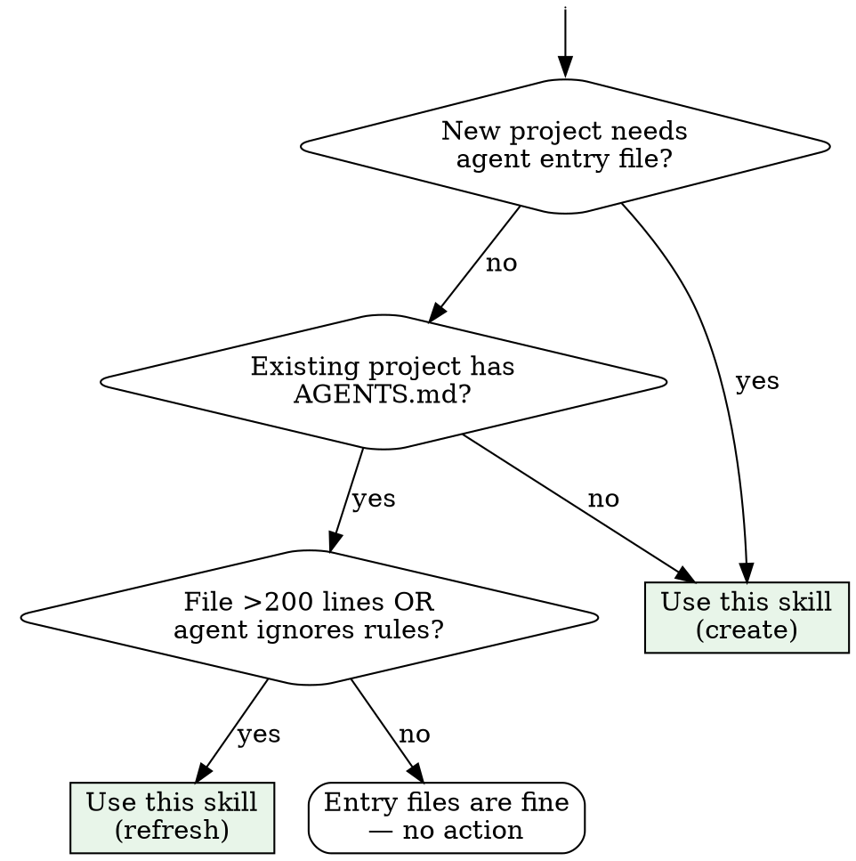

# Writing Agent Readme

## Overview

Write a 50–150 line agent entry file using the **H2 seven-section standard**. The body lives in `AGENTS.md` (cross-tool); `CLAUDE.md` imports it with one line: `@AGENTS.md`. This skill applies to both greenfield projects and refreshing stale entry files.

## When to Use



**Symptoms that trigger this skill:**
- Agent repeatedly violates conventions stated in entry files
- CLAUDE.md duplicates what AGENTS.md already says
- Entry file exceeds 200 lines and agents don't follow it
- Project has CLAUDE.md but no AGENTS.md (or vice versa)
- monorepo sub-package entry files copy-paste from root

**When NOT to use:**
- Writing ARCHITECTURE.md or deep docs
- Writing spec/plan/tasks for a feature (that's SDD, not entry files)
- Writing a one-off README.md for humans

## Core Pattern

### File Architecture

```
project-root/
├── AGENTS.md          # Main body: H2 七件套 (50–150 lines)
├── CLAUDE.md          # One line: @AGENTS.md + Claude-specific extras (≤50 lines)
└── packages/<pkg>/
    └── AGENTS.md      # Subtree-only conventions (≤30 lines typical)
```

**The invariant:** `AGENTS.md` is the single source of truth. `CLAUDE.md` imports it with `@AGENTS.md` — never duplicates its content.

### H2 七件套 (Mandatory Seven Sections)

Every `AGENTS.md` must contain these seven H2 sections, in this exact order:

```markdown
## Project Overview
## Build & Test Commands
## Coding Style
## Testing Guidelines
## Commit & PR Guidelines
## Do Not / Gotchas
## Repository Structure
```

**Section content rules:**

| Section | What goes in | What stays OUT |
|---------|-------------|----------------|
| Project Overview | 2–3 sentences: what, stack, team size. One link to ARCHITECTURE.md if exists | History, roadmap, stakeholder list |
| Build & Test Commands | Copy-pasteable shell commands only. One command per line | Explanations of why a tool was chosen |
| Coding Style | 5–8 bullet rules: naming, imports, formatting, patterns unique to this project | Generic advice ("use const not let"), ESLint rule dumps |
| Testing Guidelines | Framework, co-location rule, mock policy, how to run | Test philosophy essays |
| Commit & PR Guidelines | Branch naming, commit format, required checks | Git tutorial |
| Do Not / Gotchas | 5–8 concrete "don't do X" items with brief WHY | Vague warnings ("be careful"), obvious rules |
| Repository Structure | Top-level directory tree (≤20 lines), package list with one-line descriptions | Deep file listings, generated directory dumps |

### CLAUDE.md Pattern

```markdown
@AGENTS.md

## Claude-Specific

- Use `pnpm --filter <package> <cmd>` for monorepo operations
- [Tool-specific hooks, skills paths, or local dev notes — only if they exist]
```

If there are zero Claude-specific additions, `CLAUDE.md` contains ONLY `@AGENTS.md` and nothing else. The `@AGENTS.md` line must be the first line — no preceding headings.

## Quick Reference

| Decision | Answer |
|----------|--------|
| Main file name? | `AGENTS.md` (widest tool compatibility) |
| Root AGENTS.md length? | 50–150 lines |
| CLAUDE.md length? | ≤50 lines (mostly `@AGENTS.md`) |
| Sections required? | All 7 H2s, in exact order |
| monorepo sub-package files? | Only subtree-specific conventions; never copy parent |
| Existing project refresh? | Read current file first, preserve working info, restructure to 7 H2s |
| Code examples in root? | No — put in sub-package AGENTS.md or docs/ |
| How many "YOU MUST"? | ≤3 total across all files |
| `paths:` frontmatter? | Never on global rules; only on `.claude/rules/*.md` sub-files |

## Implementation

### Greenfield: Create from Scratch

1. Ask for: project name, stack, team size, test framework, CI tool
2. Ask for: 3–5 coding conventions unique to this project
3. Ask for: 3–5 things people commonly get wrong
4. Write `AGENTS.md` with all 7 H2s, targeting 80–120 lines
5. Write `CLAUDE.md` as `@AGENTS.md` + tool-specific notes (≤30 lines)
6. If monorepo: create stub `packages/<name>/AGENTS.md` (≤20 lines, only subtree differences)

### Brownfield: Refresh Existing Files

1. Read current AGENTS.md, CLAUDE.md, and any nested files
2. Extract what's still true; discard what's stale
3. Restructure into H2 七件套 order — never keep a custom heading name when a standard one fits
4. If CLAUDE.md duplicates AGENTS.md content → move unique bits back to AGENTS.md, reduce CLAUDE.md to `@AGENTS.md` + Claude extras
5. If any section exceeds 20 lines → move details to `docs/` and link from AGENTS.md
6. Delete any section that has no project-specific content (e.g., "use semicolons" doesn't belong)
7. Verify final AGENTS.md is 50–150 lines

### monorepo Sub-Package Files

Each sub-package `AGENTS.md` follows the **diff rule**: only write what DIFFERS from root.

```markdown
# AGENTS.md — packages/api

## Package-Specific Conventions

- Routes are thin: handlers only parse params and call services
- All SQL is parameterized — no string interpolation
- Custom errors (NotFoundError, ConflictError) map to HTTP status in error-handler.ts

## Package Structure

packages/api/
├── src/
│   ├── routes/       # Express route definitions
│   ├── services/     # Business logic
│   └── middleware/    # Auth, validation, error handling
└── migrations/       # SQL migration files
```

**Never include in sub-package files:** commands from root, global style rules, testing framework name, commit format.

## Common Mistakes

| Mistake | Fix |
|---------|-----|
| CLAUDE.md duplicates AGENTS.md content | Reduce CLAUDE.md to `@AGENTS.md` + Claude-only additions |
| Using custom H2 names ("Architecture", "Conventions") | Use the seven standard names — agents parse them more reliably |
| Sub-package file longer than root | Sub-files should be ≤30 lines; details go in `docs/` |
| Code examples in root AGENTS.md | Move to sub-package AGENTS.md or `docs/` |
| "Do Not" section is empty or generic | List 5–8 concrete, project-specific footguns with brief WHY |
| Missing Repository Structure tree | Always include top-level dir tree so agent knows where things live |
| `paths:` frontmatter on root CLAUDE.md | `paths:` rules only load when agent reads matching files; global style belongs in root without `paths:` |
| Root file >200 lines | Split: move deep content to `docs/` and link from AGENTS.md |
| CLAUDE.md uses prose redirect ("See AGENTS.md") instead of `@AGENTS.md` | `@AGENTS.md` is parsed by Claude Code / Cursor; prose redirects are not |

## Red Flags — STOP and Trim

- AGENTS.md > 150 lines after all 7 sections filled
- CLAUDE.md has its own H2 sections duplicating AGENTS.md content
- A section has more than 2 code blocks
- "Do Not" section contains "be careful" or "use good judgment"
- More than 3 "YOU MUST" across all files
- A sub-package file repeats the test framework or commit convention from root

**All of these mean: move content out or delete it.**
